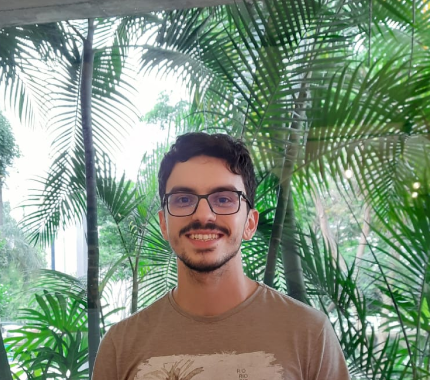

# Thiago Rivaben Lopes
Brasileiro, Geólogo, Estudante de Mestrado. 

## Dados Pessoais:

- +55 19 98780-4034
-  [thiago.rivaben@gmail.com](thiago.rivaben@gmail.com)
- 11/07/1997
-  [github.com/Thiago-177](https://github.com/Thiago-177)
-  [linkedin.com/in/thiago-rivaben-lopes-131700170/](https://www.linkedin.com/in/thiago-rivaben-lopes-131700170/)
-  [lattes.cnpq.br/0243103395438212](http://lattes.cnpq.br/0243103395438212)

## Sobre Mim
Graduado em Geologia e aluno de Mestrado em Geotecnologias. Apaixonado por dados e tecnologia, possuo experiência de mais de 3 anos de trabalho diário com Python e Dados GIS (Geographic Information System) para fins acadêmicos profissionais e pessoais. 
Atividades como coleta, preparação e análise de dados, modelagem estatística, Machine Learning, banco de dados, tratamento com dados georreferenciados em ambiente GIS e elaboração de mapas de dispersão fazem parte do meu dia a dia. 

## Profissional
Atualmente estou em conclusão de um mestrado no Instituto de Geociências da Unicamp na área de aplicação de IA em prolemas geológicos e trabalho como Geocientista pela [Eliis Latam](https://www.eliis-geo.com/index-a.html). Meu objetivo é trabalhar onde possa aplicar os conhecimentos de GIS, estatística e ciência de dados para o desenvolvimento de modelos Machine Learning em diversas áreas. 

## Projetos/Planos
Formado em Geologia pela UNICAMP e finalizando o mestrado pela mesma instituição. Busco adquirir desenvolvimento pessoal, trocando experiência com atuais profissionais do mercado e aplicando os conhecimentos e habilidades adquiridos na graduação, estágio e mestrado. Procuro incluir conhecimentos de outros campos além da geologia para contrapor desafios afim de me desenvolver como profissional, geólogo e analista de dados.  

Faço cursos online constantemente, que abordam temas como: Análise de Dados, Machine Learning, web development, desenvolvimento profissional, performance e inovação. Procuro sempre estar aprendendo algo novo e me desenvolvendo.

## Especialidades 
Interpretação Sísmica (Paleoscan), Programação em Python, Modelagem Estatística, Machine Learning (Pytorch, Scikit-learn, Tensorflow), Project Management, Análises Estatísticas, Visualizações (Matplotlib, Seaborn), Análises GIS (ArcGIS, ArcGIS Pro, QGIS) e Consulta em Base de dados Governamentais (CPRM, ANM, IBGE, Receita Federal, ANA, MAPA). 

# Formação Acadêmica
- Graduação em Geologia - Concluído em 2020 - UNICAMP (Universidade Estadual de Campinas).
- Mestrado em Geotecnologias, início 08/2021 e previsão de conclusão em Dez 2023 - UNICAMP (Universidade Estadual de Campinas).

# Atual
###  Bolsista de Mestrado pelo programa ANP, PRH 19.1 - Instituto de Geociências, Universidade de Campinas - UNICAMP 
####  Ago 2021 - Até o Momento (Remoto) 

> > <strong>Título Tese: </strong>Imageamento Hiperespectral e Geração de Modelos Preditivos da Concentração de Carbono Orgânico Total (COT) em Rochas. 

No projeto comparamos métodos tradicionais de estimar o COT a partir de dados Hiperespectrais com um método inovador de predição por modelos supervisionados de regressão, a partir de algoritmos de Machine Learning e Redes Neurais Convolucionais, em rochas betuminosas da Bacia Horn River, Canadá. O projeto resultou em uma apresentação em congresso e no momento um Artigo sobre os resultados do projeto está sendo construído.

3 Modelos preditivos (Machine Learning) foram desenvolvidos:

- 1º Baseado na aplicação de uma PCA (Principal Component Analysis) sobre os dados de entrada em um modelo SVR (Support Machine Regressor).
- 2º Baseado na aplicação de Filtros Convolucionais (Wavelet função Hann) sobre os dados de entrada em um modelo SVR.
- 3º Baseado na aplicação de uma transformada de fourier sobre as curvas de dados de entrada para obtenção de Espectrogramas (imagens) em um modelo de Rede Neural Convolucional inspirada na arquitetura Inception [Szegedy et. al. (2014)](https://doi.org/10.48550/arXiv.1409.4842).

Por fim, foi aplicado o algoritmo SHAP para obtenção de informações sobre a relação entre os outputs dos modelos e as features dos dados de entrada.

# Experiência Profissional

###  Geoscientista - Eliis Latam
####  Set 2023 - Atual

Responsabilidades:
1. Suporte ao cliente do software PaleoScan, garantindo o alto padrão de qualidade de nossa resposta de suporte, atendendo ou superando o compromisso do cliente (contrato M&S).
2. Apoio PaleoScan Petrobras através do SLA.
3. Desenvolvimento de novos projetos de Qualidade/P&D para a equipe de SLA, incluindo métodos Sísmicos Avançados (Machine Learning, AI) e qualquer funcionalidade que exija desenvolvimento de Código (Python, scripts em diferentes linguagens, linguagens de Banco de Dados, etc.)
4. Suporte Técnico Interno para Geociências em Geral, com especialização em Machine Learning, IA e infraestrutura Cloud, entre outros.

###  Bolsista DTI-C CNPQ - Embrapa Territorial
####  Fev 2021 - Jul 2021

Responsabilidades:
1. Avaliação e realização de análises espaciais de Títulos Minerários com uso potencial para agricultura; 
2. Auxílio na implementação de uma plataforma online para Aquicultura no Brasil.

Tarefas envolvidas:
- Análises Estatísticas 
- Análise de Dados GIS
- Consulta a bases Governamentais (ANM, CPRM, MAPA, IBGE, ANA)
- Auxílio no Backend da plataforma (programação em  Python, HTML, JS e Typescript)
- Resultado: construção da [Plataforma Online SITE Aquicultura](https://mapas.cnpm.embrapa.br/apps/site_aquicultura/#/map) da Embrapa.

###  Estágio - Embrapa Territorial
####  Mar 2020 - Dez 2020

Avaliação e realização de análises espaciais de Títulos Minerários com uso potencial para agricultura. Pesquisa bibliográfica da ocorrência de agrominerais e remineralizadores de solo em território nacional e construção de um banco de dados de estudos agronômicos envolvendo agrominerais.

## Projetos e Cargos durante a Graduação e Mestrado em Geologia na Universidade Estadual de Campinas - UNICAMP.

###  Mestrado
---
####  UNICAMP - Estágio Docente (PED) na Disciplina: Sistema de Informações Georreferenciadas (2S 2022).
- Atuou na assistência didática da disciplina; 
  - Supervisão e Organização de aulas e atividades práticas em laboratório;
  - Condução de Tutoriais;
  - Apoio aos estudantes no uso do software ArcGIS e QGIS.

####  [Participação na competição internacional Imperial Barrel Award (IBA)](https://drive.google.com/file/d/10pHcW9h8arwyGtlPpY-PO_2XmUhI4kAb/view?usp=sharing) - Student Chapter AAPG Unicamp (Jan 2023 - Abr 2023).
- Atuou como Project Manager na competição e auxiliou na:
  - Organização e Planejamento de Tarefas;
  - Cronograma e Suporte aos membros;
  - Intercâmbio com os Stakeholders (mentores do grupo);
- As principais atividades; desenvolvidas foram:
  - Análise de dados de poços;
  - Interpretação petrofísica; 
  - Amarração de Poços junto aos dados sísmicos;
  - Análise do Sistema Petrolífero;
- Para desenvolver as atividades trabalhei com os programas:
  - Petrel;
  - Techlog;
  - PetroMod;
  - ArcGIS

###  Graduação
---
####  [Iniciação Científica](https://drive.google.com/file/d/1zzaxuQ7jXMXx_MnbSzKH-zVnVIehFYoM/view?usp=sharing) - UNICAMP (Ago 2018 - Out 2019)
- Fomentada pelo programa PIBIC/CNPQ
- Áreas de pesquisa: Geologia Estrutural, Evolução Crustal e Integração Geológica.
- Atuou na integração dos dados de mapeamento geológico de 6 áreas na Serra da Onça, Bom jardim de Minas, MG.

####  [Iniciação Científica Voluntária](https://drive.google.com/file/d/1nJmzOYFWnshebqNNrPRtTjTktBTz7Rbj/view?usp=sharing) - UNICAMP (Ago 2016 - Ago 2017)
- Áreas de pesquisa: Educação na Geociências, Bacia de Taubaté, Modelos 3D.
- Atuou na pesquisa e produção de métodos para gerar modelos geológicos tridimensionais para ensino em geociências que resultou na criação de uma modelo 3D da Bacia de Taubaté, baseado na interpretação de dados sísmicos.

####  UNICAMP - Monitor nas Disciplinas: 
- Sistema Terra I (1S2016); 
- Sistema Terra II (2S2016);
- Sistemas de Informações Georreferenciadas (GIS) (2S2019)

Atuou na condução de tutoriais, sessões de laboratórios e revisões, apoio em atividades de campo e elaboração de mapas.

# Habilidades 
- Interpretação Sísmica (Paleoscan)
- Microsoft Office (Word, Power Point e Excel)
- ArcGIS e QGIS
- Programação em Python
- Dashboards ([Dash](https://dash.gallery/Portal/) library python)
- SHAP Values
- Programaçao em R
- Programação em SQL
- Linguagem Latex e Markdown
- Relatórios Técnicos/Científicos 
- GitHub (Versionamento de códigos)
- Básico de HTML e JS
- Básico de Power BI
- Sensoriamento Remoto e Dados Hiperespectrais
### Idiomas
- Inglês - Intermediário
- Espanhol - Básico

# Certificados 
> Programação
- [Certificado Mini-curso USP](https://drive.google.com/file/d/11eEGVQ-XLLd2JObEmhAWymQm_c-TRBsM/view?usp=sharing): "Minicurso Avançando para o Futuro: Inteligência Artificial em Geociências - Fundamentos, Importância, Aplicações e Exemplos"
- [Certificado Udemy](https://drive.google.com/file/d/1ng9py2WZQKqtjVFzEiRZFUD4G0v-VT2E/view?usp=sharing): "Aprenda Machine Learning em Python com Scikit-Learn"
- [Certificado Geovariances](https://drive.google.com/file/d/1Dki8ndnTijsEQn2Zj0PawJ12j723h9WR/view?usp=sharing): "Introdução para Geoestatística aplicada a acumulações de Óleo usando Machine Learning.

